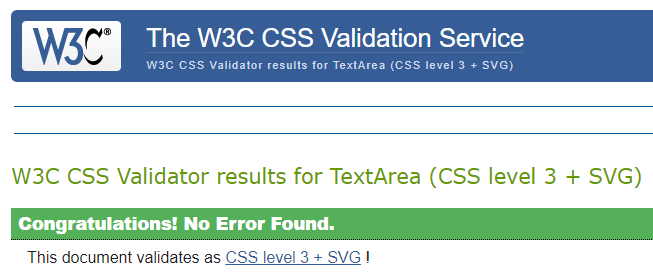

# Overview

Welcome to my front end software developer project for "Local Business Café". This README file provides information about the content, creation, and learning process involved with creating this site.

## Introduction

The website acts as advertisement and a source of information for customers regarding the cafe. They can learn about the business, get in contact/read faqs, look at the menu, and browse the cafe's shop.

## User Stories

### First Time Visitor Goals:

- As a first-time vistor, I want to know immediately what company the website is for.
- As a first-time visitor, I want to easily navigate the website.
- As a first-time visitor, I want to know where I can find the cafe.
- As a first-time visitor, I want to know what is on offer.

### Returning Visitor Goals

- As a returning visitor, I want to know if there are any new offers.
- As a returning visitor, I want to know if there are new items on the menu.

### Frequent Visitor Goals

- As a frequent visitor, I want to know if there is a loyalty/rewards program.
- As a frequent visitor, I want to know if there are any products I can get to take home.

### Target Audience Is:

- Interested in coffee & bakery treats.
- Interested in working away from their office.
- Interested in meeting other people who work from home/away from office.

## Features

### The website exists on one page with multiple sections and features visible to the user:

## Technologies Used

- [HTML](https://developer.mozilla.org/en-US/docs/Web/HTML) was used as the foundation of the webpage.
- [CSS](https://developer.mozilla.org/en-US/docs/Web/CSS) was used to add the styles and layout of the webpage.
- [CSS Flexbox](https://developer.mozilla.org/en-US/docs/Learn/CSS/CSS_layout/Flexbox) was used to arrange and wrap items on the webpage.
- [JavaScript](https://developer.mozilla.org/en-US/docs/Web/JavaScript) was used to implement and modify items with the navbar, menu, products, image gallery, and faq.
- [VSCode](https://code.visualstudio.com/) was used to write and edit code.
- [Git](https://git-scm.com/) was used as the version control of the webpage.
- [GitHub](https://github.com/) was used to host the code of the website.

## Testing

### Compatability

To confirm the website was functional, responsive, and had the correct styling.

- The webpage was tested on Chrome and Edge browsers, using default dev tools.

  - Chrome:

    
    

  - Edge:

    
    

  - The webpage was also tested using Chrome on a Samsung Galaxy S22+:
    

- The website's responsiveness was tested using Chrome Developer Tools [https://developer.chrome.com/docs/devtools](https://developer.chrome.com/docs/devtools)
  
  
  
  

- The HTML files have passed HTML validity checks with W3C, but had some warnings about sections or articles without headings and info pointers about trailing slashes on self-closing tags. Sections or articles where it did not make sense to have a heading were turned into divs, trailing slashes will be removed before final commit as these are added by default with the formatter that is currently being used.
  
  
  
  
  
  
  

- The CSS file has passed CSS validity checks with W3C.

  

- The website has been tested for performance, accessibility, best practice, and SEO using [https://pagespeed.web.dev/](https://pagespeed.web.dev/).
  
  
  
  
  
  
  

- The JavaScript files have been tested using [https://jshint.com/](https://jshint.com/)and have only returned warnings regarding certain functionality being only available in ES6.
  
## Deployment

### Deployment to GitHub Pages

- The site was deployed to GitHub pages. The steps to deploy are as follows: - In the GitHub repository, navigate to the Settings tab. - From the source section drop-down menu, select the Main Branch, then click "Save". - The page will be automatically refreshed with a detailed ribbon display to indicate the successful deployment.

- The live link can be found [here](https://heathornj.github.io/localBusinessCafe/)

## Contact

Jamie Heathorn
[heathornj@gmail.com](mailto:heathornj@gmail.com)

## Credits

- Inspiration:

  - Design ideas [https://www.sitebuilderreport.com/inspiration/cafe-coffee-shop-websites](https://www.sitebuilderreport.com/inspiration/cafe-coffee-shop-websites) & [https://www.costa.co.uk/](https://www.costa.co.uk/)
  - Favicon created using [https://favicon.io/favicon-generator/](https://favicon.io/favicon-generator/)

- Images sourced through [Canva](https://www.canva.com/) Pro Membership and [Unsplash](https://unsplash.com/)
- Logo created with [https://adobe.com/express/create/logo](https://adobe.com/express/create/logo)
